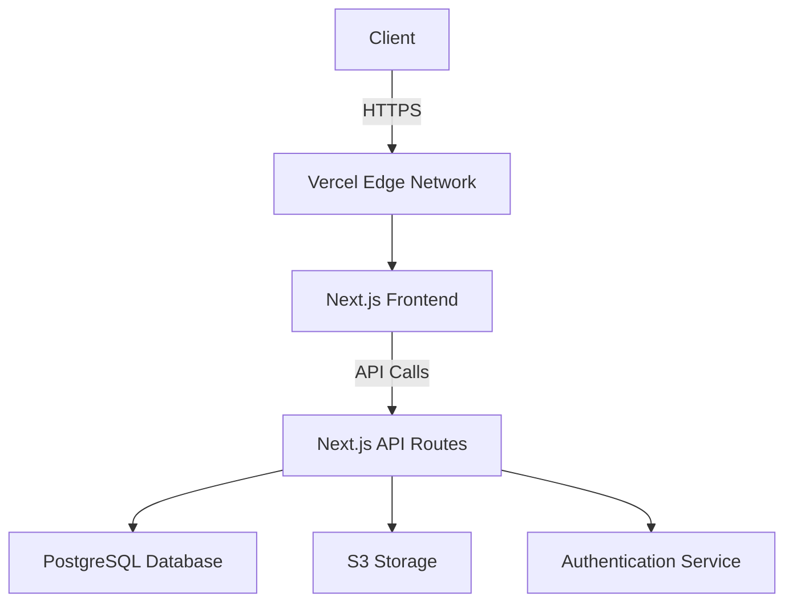

# EdgeDrive - Your Secure Cloud Storage Solution ☁️🔒


## 🌟 Introduction
EdgeDrive is a cutting-edge cloud storage solution that combines military-grade security with blazing-fast performance. Built with modern web technologies, it offers users a seamless way to store, access, and share files from anywhere in the world.

**Live Demo:** [https://edgedrive.vercel.app](https://edgedrive.vercel.app)

[](https://vercel.com/new/git/external?repository-url=your-repo-url) <!-- Add your repo URL -->

## ✨ Key Features

### 🛡️ Secure Storage
- End-to-end encryption for all files
- Zero-knowledge architecture
- Military-grade AES-256 encryption

### ⚡ Blazing Fast Performance
- Edge network delivery for low latency
- Smart caching for frequently accessed files
- Optimized file transfer protocols

### 🔄 Seamless File Management
- Drag & drop upload interface
- File previews for common formats
- Version history and recovery
- Smart organization with tags and folders

### 🤝 Easy Sharing
- Secure share links with expiration
- Password-protected shares
- Detailed access controls

## 🖥️ Screenshots

|  |  |
|-------------------------------------------|---------------------------------------------------------|
| *Home Page*                               | *Features Offered*                                      |

|  |  |
|----------------------------------------------------|----------------------------------------------------------------------|
| *How it Works*                                     | *Why Choose EdgeDrive*                                              |

|  |  |
|--------------------------------------------------|-------------------------------------------------------|
| *Login Screen*                                   | *Sign Up Screen*                                      |


|  |  |
|-----------------------------------------|-------------------------------------------------|
| *Dashboard*                             | *File Preview*                                 |

## 🛠️ Technology Stack

### Frontend
- **Framework**: Next.js
- **UI Library**: React + Tailwind CSS
- **State Management**: Zustand/Redux
- **Form Handling**: React Hook Form
- **Icons**: Lucide Icons

### Backend
- **Authentication**: NextAuth.js
- **Database**: PostgreSQL/Supabase
- **Storage**: S3-compatible storage
- **API**: Next.js API Routes

### Infrastructure
- **Hosting**: Vercel Edge Network
- **CI/CD**: GitHub Actions
- **Monitoring**: Sentry/Vercel Analytics

## 🚀 Getting Started

### Prerequisites
- Node.js v16+
- npm or yarn
- PostgreSQL database
- S3-compatible storage credentials

### Installation
1. Clone the repository:
   ```bash
   git clone https://github.com/shubham001official/edgedrive.git
   cd edgedrive
   ```

2. Install dependencies:
   ```bash
   npm install
   # or
   yarn install
   ```

3. Set up environment variables:
   ```bash
   cp .env.example .env.local
   # Fill in your credentials
   ```

4. Run the development server:
   ```bash
   npm run dev
   # or
   yarn dev
   ```

5. Open [http://localhost:3000](http://localhost:3000) in your browser.

## 🌐 Deployment

### Vercel
EdgeDrive is optimized for Vercel deployment. Simply connect your GitHub repository to Vercel and deploy with the provided configuration.

[](https://vercel.com/new/git/external?repository-url=your-repo-url)

### Docker
```bash
docker build -t edgedrive .
docker run -p 3000:3000 edgedrive
```

## 📊 Architecture Overview



## 🤝 Contributing

We welcome contributions from the community! Here's how you can help:

1. Fork the project
2. Create your feature branch (`git checkout -b feature/AmazingFeature`)
3. Commit your changes (`git commit -m 'Add some AmazingFeature'`)
4. Push to the branch (`git push origin feature/AmazingFeature`)
5. Open a Pull Request

Please read [CONTRIBUTING.md](CONTRIBUTING.md) for details on our code of conduct.

## 📜 License

This project is licensed under the MIT License - see the [LICENSE.md](LICENSE.md) file for details.

## 📧 Contact

For questions or support, please contact:
- [Email](mailto:shubham001official@gmail.com)
- [Twitter](https://twitter.com/S_Shubham001)

---

<p align="center">
  Made with ❤️ by Shubham Sharma | ⚡ Powered by Vercel
</p>
